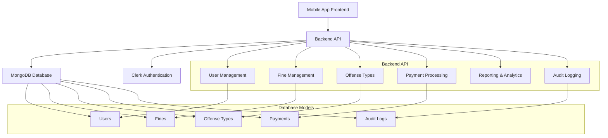

```mermaid
graph TD
    A[Mobile App Frontend] --> B[Backend API]
    B --> C[MongoDB Database]
    B --> D[Clerk Authentication]

    subgraph "Backend API"
        B1[User Management]
        B2[Fine Management]
        B3[Offense Types]
        B4[Payment Processing]
        B5[Reporting & Analytics]
        B6[Audit Logging]
    end

    subgraph "Database Models"
        C1[Users]
        C2[Fines]
        C3[Offense Types]
        C4[Payments]
        C5[Audit Logs]
    end

    B --> B1
    B --> B2
    B --> B3
    B --> B4
    B --> B5
    B --> B6

    B1 --> C1
    B2 --> C2
    B3 --> C3
    B4 --> C4
    B6 --> C5

    C --> C1
    C --> C2
    C --> C3
    C --> C4
    C --> C5
```
